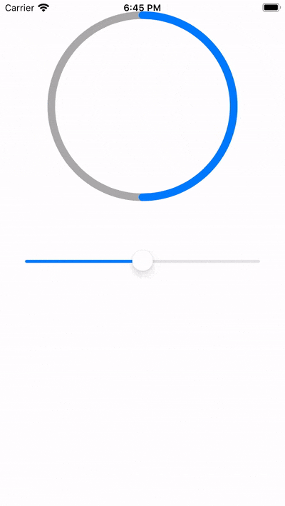

# AJCircleProgressView

## Demo



## About The Project

An UIKit circle progress view.

### Build With

[Objective-C](https://developer.apple.com/library/archive/documentation/Cocoa/Conceptual/ObjectiveC/Introduction/introObjectiveC.html)

## Getting Started

### Installation

Just copy *AJCircleProgressView.h* and *AJCircleProgressView.m* to your project.

## Usage

Drag an UIView to xib or storyboard, then assign custom class to AJCircleProgressView.

Offering following property and methods to use:

```objectivec

/// Unfilled track color
@property (nonatomic, strong) IBInspectable UIColor *trackColor;

/// Filled track stroke color
@property (nonatomic, strong) IBInspectable UIColor *strokeColor;

/// Filled progress from 0 to 1.
@property (nonatomic, assign) IBInspectable CGFloat progress;

/// Animate circle progress.
/// @param endProgress to end progress
/// @param duration duration time
/// @param completion animation completion block
- (void)animateCircleToEndProgress:(CGFloat)endProgress andDuration:(CFTimeInterval)duration withCompletion:(void(^)(void))completion;

```

## License

[WTFPL](http://www.wtfp)
